An event scheduler written in Python3, Flask, REST APIs to manage events 

# How to download/install?
1. Download this repository or clone it using `git clone https://github.com/prodigiousMind/eventia.git`
2. Once downloaded/cloned (if downloaded, then unzip it using a suitable tool), then cd to the project directory `cd eventia`, download the required libraries using pip, if not installed
`pip/pip3 install flask flask_cors json` or `python/python3 -m pip install flask flask_cors json` or simply execute the command
`pip3 install -r requirement.txt`
3. Now, if you have a web server running such as Apache HTTP then move the folder (eventia) to the server directory, then execute `flask run` this will run the app.py
4. Access the index.py (note: this is accessed through HTTP server, not through the port number the flask app is running on). By making few changes we can also implement to let index.html run on the same port as flask app (through route establishment)
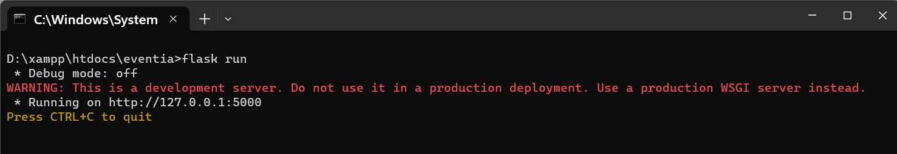
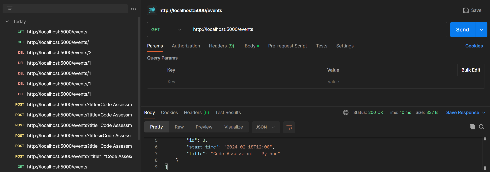

# What we can do?
1. Add events (2 sample events are already added)

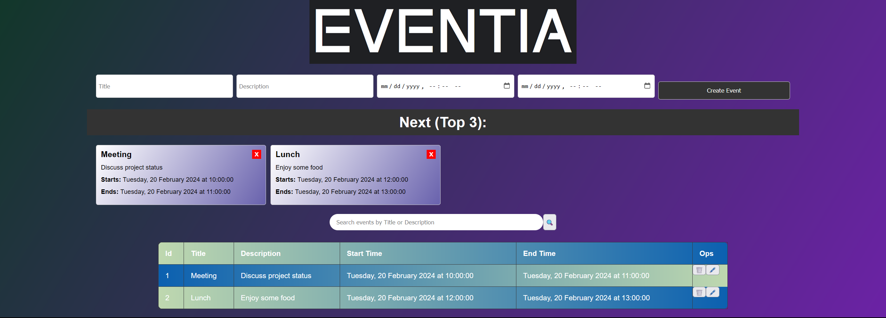
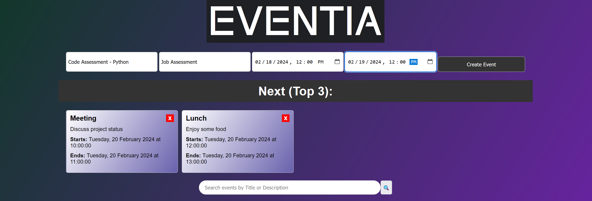
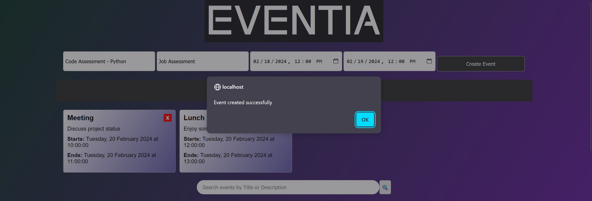
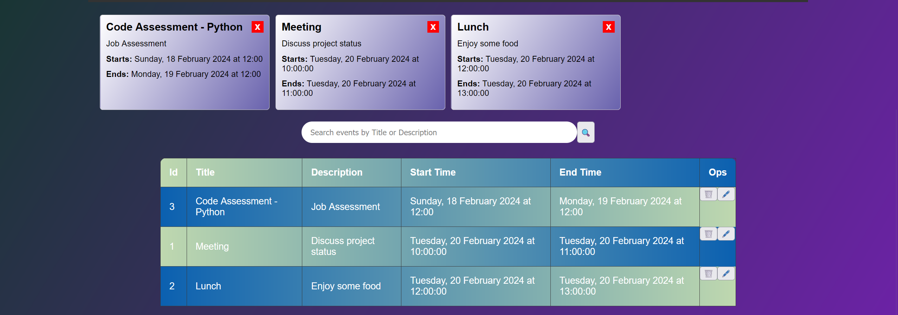

3. Modify an existing event

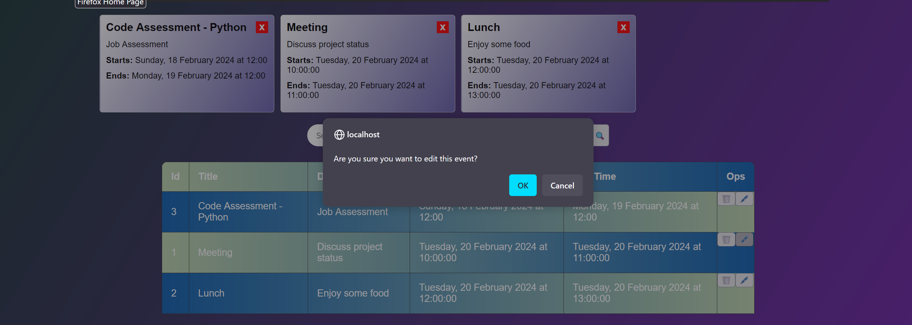
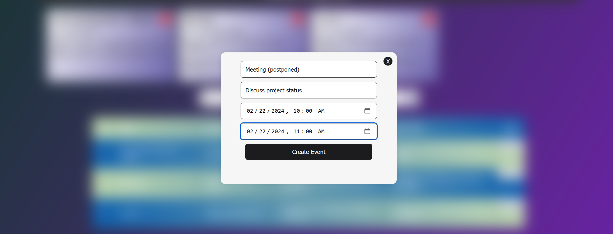
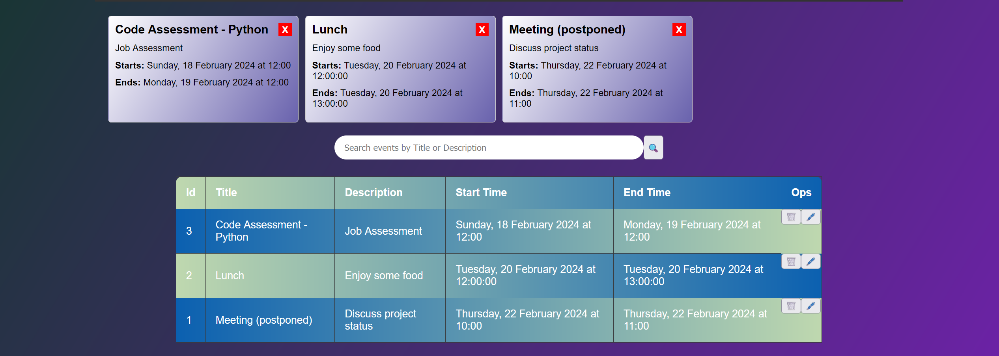

5. Delete an event

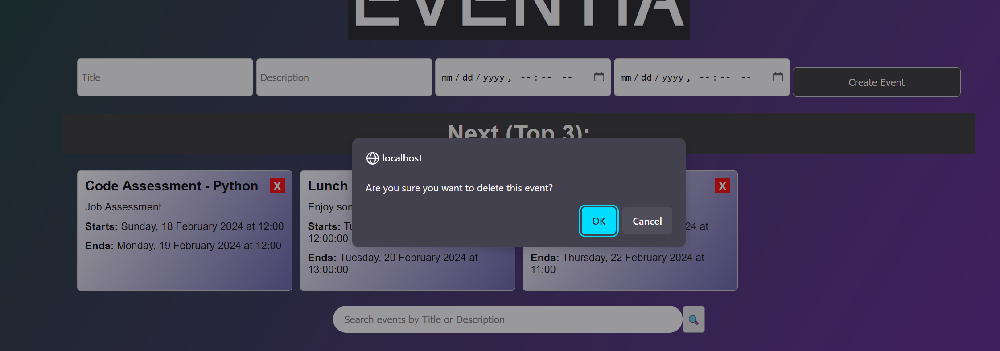
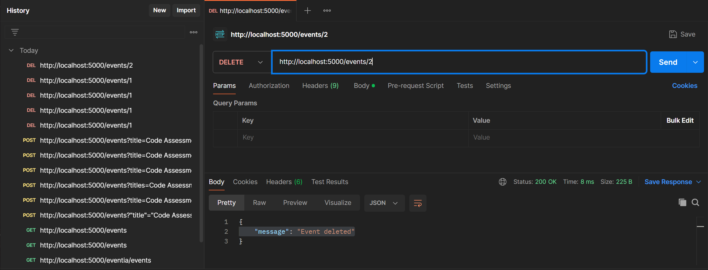

5. Search for event(s) with keyword(s) matching event title or event description

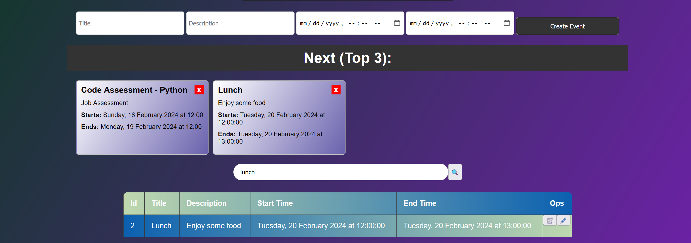

Future Implementation:
1. Add support for events that recur daily, weekly, or monthly.
2. Notification through email
3. Desktop app version
4. etc

